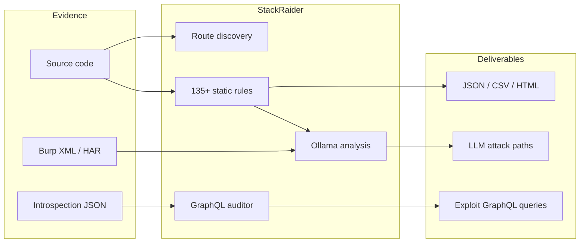

<div align="center">

<pre>
 ▄▄▄▄▄▄▄                         ▄▄▄▄▄▄▄                ▄▄             
█████▀▀▀  ██              ▄▄     ███▀▀███▄       ▀▀     ██             
 ▀████▄  ▀██▀▀ ▀▀█▄ ▄████ ██ ▄█▀ ███▄▄███▀  ▀▀█▄ ██  ▄████ ▄█▀█▄ ████▄ 
   ▀████  ██  ▄█▀██ ██    ████   ███▀▀██▄  ▄█▀██ ██  ██ ██ ██▄█▀ ██ ▀▀ 
███████▀  ██  ▀█▄██ ▀████ ██ ▀█▄ ███  ▀███ ▀█▄██ ██▄ ▀████ ▀█▄▄▄ ██    

╔══════════════════════════════════════════════════════════════════╗
║  ▸ code scan   ▸ burp traffic   ▸ graphql audit   ▸ local llm   ║
║              ▼  raid the full application stack  ▼              ║
╚══════════════════════════════════════════════════════════════════╝
</pre>

## DISCLAIMER!!
**_I've vibe coded the sh!t out of this app, so there may be dragons inside_**

</br>

**Raid the full application stack — source, traffic, and GraphQL — with offline static analysis and local LLM triage.**

[](https://www.python.org/)
[](LICENSE)
[]()
[-000?style=flat-square&logo=ollama)](https://ollama.com/)

[Quick Start](#-quick-start) · [Web UI](#-web-ui) · [CLI Reference](#-cli-reference) · [API](#-api) · [Rules](#-vulnerability-coverage)

</div>

---

## What is StackRaider?

StackRaider merges **static code scanning**, **Burp Suite traffic cross-reference**, **GraphQL schema auditing**, and **local LLM analysis** into one offline pentest workflow. No SaaS, no API keys — everything runs on your machine.



| Module | What it does |
|--------|----------------|
| **Code scan** | Regex-based static analysis across JS/TS, PHP, Python with route-aware findings |
| **Burp import** | Parse `.xml`, `.har`, or `.burp` exports; match live traffic to discovered routes |
| **GraphQL audit** | Parse introspection JSON → static rules → auto-generated test queries → optional LLM pass |
| **LLM triage** | Local Ollama correlates code findings, Burp requests, and schema data into attack paths |

---

## Quick Start

### 1. Install

```bash
git clone https://github.com/yourusername/srcsniff.git
cd srcsniff

python -m venv .venv && source .venv/bin/activate
pip install -r requirements.txt
pip install -e .          # installs the `stackraider` CLI
```

### 2. Scan (CLI)

```bash
stackraider scan /path/to/project
stackraider scan . --severity HIGH --html report.html
```

### 3. Web UI (recommended)

```bash
cd frontend && npm install && npm run build && cd ..
stackraider web --port 8001
```

Open **http://127.0.0.1:8001** — Code scan, Burp import, GraphQL analysis, and LLM chat in one interface.

> **Tip:** If the browser won't connect, disable Burp/Firefox proxy for `127.0.0.1`.

### 4. GraphQL (headless)

```bash
stackraider graphql --file introspection.json
stackraider graphql --file introspection.json --llm --model llama3.2
```

---

## Web UI

The unified interface is organized into three sections. Session state persists across tabs — scan results, Burp traffic, and GraphQL findings survive navigation.

| Section | Routes | Purpose |
|---------|--------|---------|
| **Code** | `/code/scan` · `/code/results` · `/code/burp` · `/code/analysis` | Static scan, traffic import, LLM attack-path analysis |
| **GraphQL** | `/graphql` · `/graphql/schema` · `/graphql/findings` · `/graphql/queries` | Introspection audit, schema explorer, exploit queries |
| **Shared** | `/models` · `/settings` | Pull/manage Ollama models, configure host & defaults |
| **Correlate** | `/code/correlation` | Link code `GQL-*` rule hits ↔ live schema findings; export session JSON |

---

## CLI Reference

```bash
stackraider scan <path> [options]     # Static security scan
stackraider web [path] [--port N]     # Launch unified web UI
stackraider graphql --file <json>     # Headless GraphQL audit
```

### Scan highlights

```bash
# Severity filter
stackraider scan . --severity HIGH

# Custom grep across codebase
stackraider scan . --grep "password|secret|api_key"

# Pentest exports
stackraider scan . --burp sitemap.xml --urls urls.txt --csv findings.csv

# Exploitation cheatsheets (SSTI, SQLi, XSS, JWT, …)
stackraider scan --cheatsheet list
stackraider scan --cheatsheet xss

# Attack surface map (on by default when routes found)
stackraider scan . --no-attack-surface

# Diff against previous JSON scan
stackraider scan . --baseline previous.json
```

### Legacy entry point

`python scanner.py` still works but prints a deprecation warning — prefer `stackraider scan`.

---

## API

Namespaced REST + SSE + WebSocket endpoints served by the unified FastAPI backend.

| Prefix | Examples |
|--------|----------|
| `/api/code/*` | `POST /api/code/scan` · `POST /api/code/analyze` · `POST /api/code/burp/upload` |
| `/api/graphql/*` | `POST /api/graphql/analyze` (SSE stream) · `GET /api/graphql/state` |
| `/api/session` | Unified session summary + cross-module correlations |
| `/api/export` | Full session bundle (scan + burp + graphql + analyses) |
| `/api/models/*` | List, pull, and delete Ollama models |
| `/api/chat` | WebSocket schema-aware LLM chat |

Legacy aliases (`/api/scan`, `/api/analyze`, …) remain for backward compatibility.

---

## Configuration

| Variable | Default | Description |
|----------|---------|-------------|
| `STACKRAIDER_OLLAMA_HOST` | `http://localhost:11434` | Ollama API endpoint |
| `STACKRAIDER_DEFAULT_MODEL` | `llama3.2` | Default model for analysis & chat |

Requires [Ollama](https://ollama.com/download) running locally for LLM features (`ollama serve`).

---

## Vulnerability Coverage

**135+ rules** across four language stacks, mapped to CWE IDs with built-in exploitation guidance.

<details>
<summary><strong>JavaScript / TypeScript</strong> — 52 rules</summary>

| Category | Examples |
|----------|----------|
| Command Injection | `exec()`, `eval()`, `child_process` |
| SQL / NoSQL Injection | String-built queries, Mongo operators |
| XSS | `innerHTML`, `dangerouslySetInnerHTML` |
| SSRF / Path Traversal | User-controlled URLs and file paths |
| Auth & Secrets | Hardcoded credentials, JWT misconfig |
| Prototype Pollution | `Object.assign`, deep merge sinks |
| Deserialization | `node-serialize`, unsafe `JSON.parse` flows |
| CORS / Crypto | `Access-Control-Allow-Origin: *`, MD5/SHA1 |

</details>

<details>
<summary><strong>PHP</strong> — 40 rules</summary>

| Category | Examples |
|----------|----------|
| Command / Code Injection | `system()`, `eval()`, `preg_replace /e` |
| SQL Injection | `mysqli_query`, unprepared PDO |
| LFI / RFI | `include()`, `require()` with user input |
| XSS / SSTI | Unsanitized `echo`, Twig/Blade injection |
| SSRF / XXE | `file_get_contents()`, `simplexml_load_string` |
| File Upload | Unrestricted `move_uploaded_file()` |
| Session / Auth | Fixation, type juggling (`==`) |

</details>

<details>
<summary><strong>Python</strong> — 28 rules</summary>

| Category | Examples |
|----------|----------|
| Command Injection | `os.system()`, `subprocess` with `shell=True` |
| SQL Injection | `cursor.execute()` with f-strings |
| SSTI | `render_template_string()` |
| Flask Debug | `app.run(debug=True)` — Werkzeug RCE |
| Deserialization | `pickle.loads()`, `yaml.load()` |
| SSRF / XXE | `requests.get()`, `etree.parse()` |
| Secrets / JWT | Hardcoded `SECRET_KEY`, `verify=False` |

</details>

<details>
<summary><strong>GraphQL (code + schema)</strong></summary>

- **In source:** `rules_graphql.py` flags introspection enabled, missing auth, dangerous resolvers
- **In schema:** StackRaider audits live introspection for IDOR chains, DoS nesting, sensitive fields, and generates replay-ready test queries

</details>

### File types scanned

| Language | Extensions |
|----------|------------|
| JavaScript / TypeScript | `.js` `.ts` `.tsx` `.jsx` `.mjs` `.cjs` |
| PHP | `.php` `.phtml` `.inc` … |
| Python | `.py` `.pyw` |

Excluded by default: `node_modules/`, `vendor/`, `.git/`, `dist/`, `build/`, `*.min.js` — use `--include-vendor` for full-app audits.

---

## Output & Reports

```bash
stackraider scan . --brief                          # One-liner triage
stackraider scan . --output report.json             # Machine-readable
stackraider scan . --csv findings.csv --html report.html
stackraider scan . --secrets                        # Copy-paste secrets inventory
stackraider scan . --no-exploitation                # Findings only, no payloads
stackraider scan . --verbose                        # Include remediation text
```

### Example (brief mode)

```
/app/api/utils.js:45:CRITICAL:Command Injection via child_process.exec
/app/auth/login.js:23:HIGH:Hardcoded Password
/app/db/query.js:67:CRITICAL:SQL Injection via String Concatenation
```

---

## JavaScript Unminifier

Beautify minified bundles before scanning:

```bash
python unminify.py bundle.min.js -o readable.js
stackraider scan . --unminify
```

---

## Pentest Workflow Tips

```bash
# Full assessment pipeline
stackraider scan /target --include-vendor --severity MEDIUM --csv notes.csv
stackraider scan /target --grep "password|secret|key|token" --include-vendor
stackraider web /target                              # Import Burp + run LLM analysis

# When you hit a specific vuln class
stackraider scan --cheatsheet ssti
stackraider scan --cheatsheet sqli
```

1. Scan with `--include-vendor` — vulns often live in dependencies  
2. Use `--brief` for fast triage, then drill into HIGH+  
3. Import Burp history in the web UI to ground LLM analysis in live traffic  
4. Paste GraphQL introspection to cross-check code `GQL-*` findings  
5. Export the session bundle from **Correlate** for your report  

---

## Project Structure

```
stackraider/
├── cli.py                 # stackraider scan | web | graphql
├── core/                  # Scanner engine + rules
├── graphql/               # Schema parser, static analyzer, query generator
└── web/                   # FastAPI server, Burp parser, LLM layer, static UI

frontend/                  # React + TypeScript + Tailwind (Vite)
scanner.py                 # Deprecated shim → use stackraider CLI
```

---

## Ethical Use

This tool is for **authorized security testing only**.

- Only scan code and systems you have permission to test  
- Use exploitation guidance to verify and remediate — not to attack  
- Report findings responsibly  

---

## Contributing

New rules belong in `stackraider/core/rules*.py`:

1. Add a `SecurityRule` with regex, severity, CWE, exploitation text  
2. Test against `test_samples/`  
3. Keep exploitation guidance actionable (payloads, curl, context)  

---

## License

MIT — see [LICENSE](LICENSE).

## Acknowledgments

Rule patterns and guidance informed by [Semgrep](https://semgrep.dev/), [OWASP Top 10](https://owasp.org/Top10/), [PayloadsAllTheThings](https://github.com/swisskyrepo/PayloadsAllTheThings), [HackTricks](https://book.hacktricks.xyz/), and the [CWE database](https://cwe.mitre.org/).
