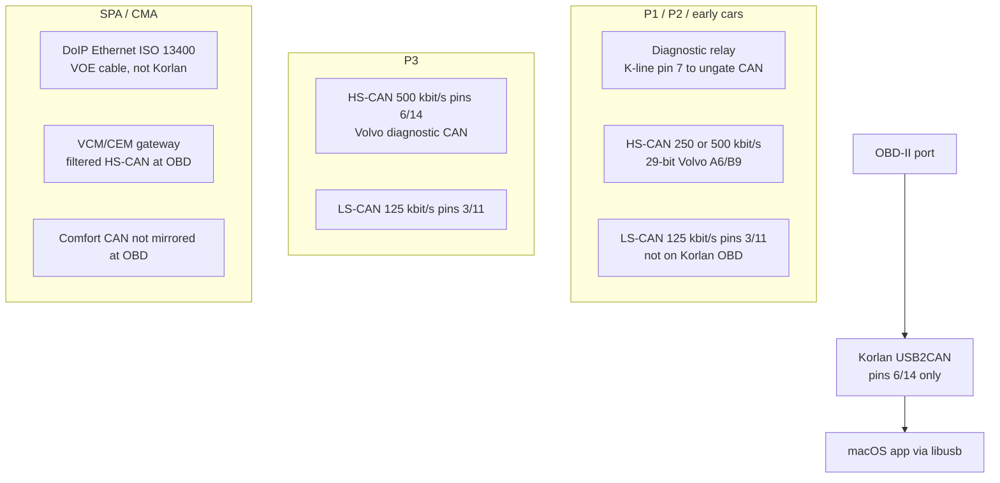

# Recreating VDASH on macOS with a Korlan USB2CAN

Research and implementation plan. This is not a 1:1 clone of D5T5 VDASH, and it cannot be: VDASH talks J2534 / DiCE and DoIP Ethernet, while Korlan is a single-channel classical CAN adapter with no official macOS driver.

The realistic product is an independent, owner-facing Volvo diagnostic app that runs natively on macOS, uses the Korlan over libusb, and covers the subset of VDASH that actually travels over CAN at the OBD-II port.

## Verdict

| Question | Answer |
| --- | --- |
| Can Korlan work on macOS at all? | Yes. No kernel driver is required. Talk to it with libusb using the `usb_8dev` protocol (VID `0483`, PID `1234`). |
| Can we ship a useful diagnostic GUI on that path? | Yes. python-can + `python-can-usb8dev` + ISO-TP + UDS already exist and have been proven on an M1 Mac with this exact adapter. |
| Can that app replace VDASH? | No. Hardware, transport, and protocol do not match. A Korlan-only tool is valuable for P1/P2/P3 CAN-era cars and for raw HS-CAN sniffing. It is the wrong cable for SPA/CMA workshop diagnostics. |
| Should we copy VDASH feature-for-feature? | No. PIN decoding, key programming, module cloning, ECU flashing, and speed-limiter removal are out of scope. |

## What VDASH actually is

VDASH (D5T5) is Windows-only Volvo workshop software. It requires an internet connection and one of:

- Volvo DiCE (J2534)
- SUPER J2534 / compatible PassThru
- VOE Ethernet-to-OBD (DoIP) for SPA/CMA only

Marketed capabilities:

- Read/clear DTCs, live data, readiness, service-interval reset
- CEM/ECM configuration (STOP/START, video in motion, region, language, SRI)
- ECU software updates, injector coding, module cloning
- CEM/ECM PIN decoding, key/remote pairing, SCL/SCU pairing
- Odometer-tamper detection

Supported platforms: P80, P1, P2, P3, SPA, CMA, Polestar 1/2 (1999–present, excluding first-gen S/V40).

None of those interfaces is a Korlan. VDASH has no USB2CAN / SocketCAN backend.

## What the Korlan actually is

[8devices Korlan USB2CAN](https://www.8devices.com/products/korlan) is a galvanically isolated USB 2.0 Full Speed to ISO 11898-2 adapter.

| Spec | Value |
| --- | --- |
| MCU | STM32F072 (Cortex-M0), 32 MHz CAN clock |
| Transceiver | TI ISO1050, 2.5 kV isolation |
| USB identity | Vendor-specific class `0xFF`, VID `0483`, PID `1234` |
| CAN | 2.0A (11-bit) and 2.0B (29-bit) only. No CAN FD. |
| Bitrate | Roughly 20–2000 kbit/s, user-defined timing |
| Modes | Normal, silent/listen-only, loopback, one-shot |
| Channels | One CAN channel per adapter (up to 4 adapters per host) |
| Official OS | Windows (CANAL `usb2can.dll` + WinUSB) and Linux SocketCAN (`usb_8dev`). **No macOS.** |
| OBD-II wiring | Pins 6 (CAN-H) and 14 (CAN-L) only. Pins 3/11 (Volvo LS-CAN), 7 (K-line), and Ethernet DoIP pins are **not connected**. |
| Termination | None. The car provides bus termination. |

Linux kernel driver: `drivers/net/can/usb/usb_8dev.c` (in-tree since 3.9). Command protocol uses 16-byte framed commands (`0x11` … `0x22`); CAN frames are 16-byte TX / 21-byte RX (`0x55` … `0xAA`). Four bulk endpoints: data RX/TX and command RX/TX.

The vendor test app [kcan](https://github.com/8devices/korlan-usb2can-test-application) is Python + python-can, Windows (`usb2can` + CANAL DLL) or Linux (SocketCAN). It does not run on macOS.

python-can’s built-in `usb2can` interface is **Windows-only** (loads `usb2can.dll`). A native libusb backend was proposed in [hardbyte/python-can#979](https://github.com/hardbyte/python-can/pull/979) (tested on an M1 MacBook Air with Korlan firmware 2.3, ~300 frames/s ISO-TP at 500 kbit/s) and never merged. The maintained replacement is [`python-can-usb8dev`](https://pypi.org/project/python-can-usb8dev/) (PyPI 0.1.0, July 2026), which registers interface `usb8dev` and works on macOS, Windows, and Linux without a vendor DLL.

## Platform matrix: where Korlan can and cannot replace VDASH

Volvo diagnostics changed transport by generation. The Korlan OBD-II variant only ever sees **HS-CAN on pins 6/14**.



| Platform | Typical years | Diagnostic transport at OBD | Korlan OBD cable | Notes |
| --- | --- | --- | --- | --- |
| P80 / early P2 | ~1999–2004 | Often K-line + gated CAN | Weak | Some cars need a K-line keep-alive on pin 7 to close the diagnostic relay before CAN appears on 6/14. Korlan cannot send K-line. Workaround: Y-split with a K-line dongle, or tap the bus behind the CEM. |
| P1 / facelift P2 | ~2004–2014 | HS-CAN 500 kbit/s (some pre-facelift HS is 250 kbit/s), LS-CAN 125 kbit/s, 29-bit IDs | **Best fit** | Volvo A6/B9 framing, not ISO-TP UDS. Community protocol docs exist (Volvo-CAN-Gauge, VolvoDiagToolkit). LS-CAN is pins 3/11 — second Korlan + custom OBD breakout, or ignore body modules. |
| P3 | ~2010–2018 | Diagnostic CAN on 6/14; still Volvo-flavored | Good for DTCs / live data on powertrain/chassis | Confirm addressing per model. Body/comfort still on a second bus. |
| SPA / CMA / Polestar | ~2016+ | **DoIP** (ISO 13400) over OBD Ethernet. VCM gateways CAN. | **Wrong tool** | You will see some filtered HS-CAN and legislated 11-bit OBD. You will not get VDASH-class module access, coding, or flashing. Use a USB-Ethernet VOE adapter for that, as a later optional transport in the same app. |

Korlan is also useful as a **listen-only sniffer** on any exposed HS-CAN tap (ABS connector, under-hood fuse box, etc.) even on SPA, but that is not “recreating VDASH.”

## Feature mapping

What a macOS + Korlan app can honestly ship, versus VDASH.

| VDASH feature | With Korlan on macOS | Plan |
| --- | --- | --- |
| Detect adapter, set bitrate, silent/loopback | Yes | Phase 0 |
| Raw CAN monitor, send, log (ASC/BLF/CSV) | Yes | Phase 1 |
| Legislated OBD-II (ISO 15765-4, 11-bit, 500 kbit/s) | Yes on cars that speak it at 6/14 | Phase 2 |
| UDS over ISO-TP (ISO 14229 / 15765) | Yes where the ECU speaks UDS | Phase 2 |
| Volvo A6/B9 diagnostic reads (P1/P2) | Yes, community-documented | Phase 3 |
| Read DTCs, freeze frame, VIN, live parameters | Yes (protocol-dependent) | Phases 2–3 |
| Clear DTCs | Possible, gated | Phase 3, explicit confirm |
| Service interval reset / language / STOP-START / region | Needs CEM config blocks + PIN | Out of scope until a read-only config dump exists; writes stay gated forever without owner-supplied PIN |
| ECU flashing / “performance” maps | Needs J2534 or DoIP + vendor files | Out of scope |
| CEM/ECM PIN decoding | Security bypass | Out of scope |
| Key programming, module cloning, odometer tools | Immobilizer / safety / fraud | Out of scope |
| SPA/CMA full diagnostics | Needs DoIP, not CAN | Phase 5 optional, different cable |

## macOS USB path (this is the tractable part)

Korlan presents as a vendor-specific USB device. macOS does **not** bind a kernel driver to `0483:1234`, so libusb can claim it from user space. No DriverKit dext, no kext, no Apple USB entitlement for basic access.

```python
import can
# pip install python-can-usb8dev  (pulls pyusb + libusb-package)

print(can.detect_available_configs(interfaces=["usb8dev"]))

with can.Bus(interface="usb8dev", channel="ED000001", bitrate=500000,
             listen_only=True) as bus:
    for msg in bus:
        print(msg)
```

`libusb-package` vendors libusb-1.0 as a wheel, so Homebrew is not required.

Packaging caveats:

- Do **not** App-Store-sandbox the app; USB device access will fail. Distribute as a signed Developer ID `.app` (or unsigned local Python) outside the App Store.
- CLI tools can talk to the device as a normal user; no root, no udev analogue.
- If some other driver ever claims the device, libusb detach on macOS needs `com.apple.vm.device-access` and is painful. Today nothing claims Korlan, so ignore DriverKit.
- Apple Silicon: confirmed working (python-can #979 test harness). Prefer universal / arm64 Python 3.11+.
- USB hubs and cheap USB-C dongles: Full Speed bulk can drop frames under load. Prefer a direct port. Target budget: 300+ frames/s, which is enough for ISO-TP diagnostics and typical HS-CAN idle, but a fully loaded bus can exceed USB FS + userspace ISO-TP timing. Listen-only sniffing is the stress case; keep a drop counter.

Self-test without a car: `usb8dev-record --loopback`.

## Recommended architecture

Reuse the Python CAN/UDS ecosystem. Do not rewrite USB, ISO-TP, or UDS in Swift.

```
┌─────────────────────────────────────────────────────────┐
│  macOS UI  (Tauri + React, or pywebview, or SwiftUI)    │
│  adapter picker, bitrate, listen-only default,          │
│  trace view, DTC table, live gauges, session log        │
└───────────────────────────┬─────────────────────────────┘
                            │ localhost IPC / REST
┌───────────────────────────┴─────────────────────────────┐
│  Diagnostic engine (Python 3.11+)                       │
│    transports/korlan.py     python-can usb8dev          │
│    transports/obd.py        ISO-TP + SAE J1979          │
│    transports/uds.py        udsoncan + can-isotp        │
│    transports/volvo_a6.py   29-bit Volvo diagnostic     │
│    catalog/                 PID / DID / A6 maps (OSS)   │
│    safety.py                listen-only default,        │
│                             write confirm, bitrate lock │
└───────────────────────────┬─────────────────────────────┘
                            │ libusb
┌───────────────────────────┴─────────────────────────────┐
│  Korlan  VID 0483 PID 1234  usb_8dev protocol           │
└─────────────────────────────────────────────────────────┘
```

**Why this stack**

- `python-can-usb8dev` is the only production-quality Korlan backend that works on macOS.
- `can-isotp` + `udsoncan` are the standard userspace ISO-TP/UDS pair when SocketCAN is unavailable (macOS has no SocketCAN).
- Userspace ISO-TP can miss `STmin` under load; that is acceptable for diagnostic request/response, not for flashing.
- A thin Tauri or pywebview shell keeps the UI native-feeling without rewriting the bus layer. SwiftUI talking to a local Python engine is also fine if we want a real `.app`; the engine stays Python.

**Do not** depend on python-can’s `usb2can` interface, CANAL DLLs, or Wine.

Single-channel reality: one Korlan = one bus. UI should allow two adapters (HS 500k + LS 125k) later. Phase 1 is one adapter.

## Protocol work (the actual product)

### 1. Generic CAN (no Volvo knowledge)

Bus on/off, bitrate presets (125k / 250k / 500k / 1M), silent default, frame table, filters, logging. This already replaces kcan on macOS.

### 2. Legislated OBD-II

ISO 15765-4: functional 11-bit IDs (`0x7DF` / `0x7E8`–`0x7EF`), 500 kbit/s. Mode 01 PIDs, Mode 03/07/0A DTCs, Mode 09 VIN/CALID. Many Volvos answer this on pins 6/14; some P1 diesels do not (VolvoDiagToolkit found generic OBD useless on a 2007 V50 D4164T and had to use 29-bit A6 instead). Auto-fallback is required.

### 3. UDS where it exists

ISO 14229 over ISO-TP. Session control, tester present, ReadDTCInformation (`0x19`), ReadDataByIdentifier (`0x22`), ECU reset only if ever enabled. Addressing is per-module and per-platform; start with a scan of common 11-bit pairs, then 29-bit ISO-TP if needed.

### 4. Volvo A6/B9 (P1/P2, parts of P3)

Not UDS. Community description (Volvo-CAN-Gauge / VolvoDiagToolkit): 29-bit IDs, 8-byte frames, first byte DLC, second byte ECU address, service bytes in the remaining payload. Parameter catalogs in VIDA “CarCom” are proprietary SQL — **do not extract or ship them**. Seed the catalog from:

- Community lists already published (e.g. boost / rail / EGT IDs)
- Captures the owner makes on their own car (request/response recorder)
- Open papers / forum-documented IDs, attributed

Write path for CEM configuration is a checksummed block plus a per-car PIN that is not in CarCom. That is why VDASH charges for PIN decode. This project does not implement PIN brute force (see `vtl/volvo-cem-cracker` — Arduino, HS-CAN timing attack, P1/P2/P3 only). If the owner already has their PIN, a later opt-in writer can be discussed; it is not in the MVP.

## Phased plan

### Phase 0 — Hardware bring-up on macOS

Goal: prove the cable against this Mac, no car required.

- Install Python 3.11+, `python-can-usb8dev`
- `usb8dev-record --list` sees serial
- Loopback send/receive
- Document: USB port, `ioreg` / System Information identity, firmware version via `GET_SOFTW_HARDW_VER`
- Note whether the unit is OBD-II or DB9 (pinout differs; DB9 is CiA-232: pin 7 CAN-H, pin 2 CAN-L)

Exit: a one-page “it works on this Mac” log plus a `can_logger` capture from loopback.

### Phase 1 — macOS CAN console (kcan equivalent)

Goal: SavvyCAN-lite that is Korlan-native.

- Detect serial, bitrate, listen-only / loopback / one-shot
- Live trace, ID histogram, error frames (bus-off, stuff, form, ACK)
- TX a crafted 11/29-bit frame (disabled while listen-only)
- Log to `.asc` / `.csv`
- Ship as `python -m vdash` and a unsigned `.app` via Briefcase or PyInstaller

This is already useful and unblocks everything else.

### Phase 2 — OBD-II + UDS client

Goal: “scan tool” for any car that speaks standard diagnostics on 6/14.

- Bitrate 500k, listen-only first 2 s to see if the bus is alive
- OBD-II PID dashboard (RPM, coolant, MIL, VIN)
- UDS DTC read (`0x19 0x02`) with ISO-TP
- Module scan (tester present + tester present timeout)
- Safety: default listen-only; “enter diagnostic session” is a second button

Libraries: `can-isotp`, `udsoncan`, `obd` only if it can be pointed at python-can (many OBD libs assume serial ELM327 — prefer implementing J1979 on ISO-TP ourselves).

### Phase 3 — Volvo CAN-era diagnostics (the VDASH-shaped MVP)

Goal: P1/P2/P3 owner tool: identify the car, list modules, read DTCs, show a small live-data set.

- Platform profiles: bitrate, 11 vs 29-bit, A6 vs UDS
- Volvo A6 request/response codec + ECU address table (CEM, ECM, BCM, DIM, …)
- DTC decode using public SAE + a small Volvo-specific table we maintain
- Live parameters that are independently documented (boost, rail, oil temp, battery, vehicle speed)
- Clear DTCs behind `--enable-writes` and a typed confirmation
- Session report PDF/HTML (the one VDASH feature that is just UI)

Hardware note: if the car has a diagnostic relay, Phase 3 documents a Y-cable + ELM/K-line keep-alive; we do not bit-bang K-line on the Korlan.

### Phase 4 — Dual adapter and LS-CAN

Second Korlan (or DB9 tap) at 125 kbit/s for body/DIM. Same UI, two `usb8dev` channels. Only after Phase 3 is stable.

### Phase 5 — Optional DoIP (not Korlan)

SPA/CMA workshop coverage is a **different physical layer**. Add `python-doipclient` + UDS over ISO 13400 using a USB-Ethernet adapter and a VOE cable. Share the UI and DTC catalog; do not pretend the Korlan is doing this.

Skip unless SPA is a real requirement. VDASH on SPA is DoIP; Korlan will not get there.

## Safety and legal constraints

- Default **listen-only**. Wrong bitrate on a live HS-CAN will bus-off ECUs and can set persistent DTCs (reported on P2 HS-CAN).
- No security-access brute force, CEM cracker, key learning, or odometer tools.
- No redistribution of VIDA CarCom, VDASH binaries, or D5T5 paid databases.
- No cloning of VDASH branding or paid feature set.
- Writes (clear DTC, later config) require an explicit enable flag, per-action confirm, and a post-read.
- Use only on vehicles the operator owns or is authorized to service.
- Do not inject on SPA comfort CAN from a random tap.

## Alternatives if the goal is “use VDASH,” not “rebuild it”

1. **Windows VM + official VDASH + DiCE/J2534 or VOE.** This is the only way to get real VDASH. Korlan will not plug into it. USB passthrough of J2534 devices through VMs is historically flaky; a cheap used Windows laptop is the workshop pattern.
2. **SavvyCAN** (Qt, runs on macOS) for raw capture. Still needs a macOS CAN backend; Korlan is not a first-class SavvyCAN device. Could feed SavvyCAN via a local socket if we write a `usb8dev` → SLCAN or socketcand bridge — useful, not a diagnostic app.
3. **VolvoDiagToolkit** — read-mostly VIDA-protocol client with J2534 / SocketCAN / ELM notes. Linux/Windows oriented. We can borrow protocol insights, not CarCom dumps.
4. **Buy a PEAK PCAN-USB** and use MacCAN/PCBUSB if we want a commercial macOS driver instead of Korlan. That abandons the stated hardware.

## Suggested repo layout (new project, not this pentest scanner)

```
vdash-macos/
  pyproject.toml
  src/vdash/
    app.py                 # CLI + local API
    usb8dev_bus.py         # thin wrapper, bitrate tables
    obd.py
    uds.py
    volvo_a6.py
    safety.py
    catalog/
  ui/                      # Tauri or webview
  docs/
    hardware.md            # Korlan pinout, Volvo OBD, relay
    protocol-a6.md
  tests/
    test_loopback.py       # hardware optional
    test_a6_codec.py       # no hardware
```

This document lives in `stackraider` only as the research artifact for the current request. Implementation should be a dedicated repo.

## Open decisions

1. **Target car.** P1/P2/P3 vs SPA changes the entire transport. If the car is SPA, stop and use DoIP; Korlan is a sniffer only.
2. **Connector.** OBD-II Korlan vs DB9 + breakout. OBD-II is simpler for HS-CAN; DB9 is better if we will tap LS-CAN or a non-OBD point.
3. **UI.** Python desktop (ttkbootstrap, like kcan) is fastest. Tauri looks more like a Mac app. Pick after Phase 1.
4. **Second cable.** K-line keep-alive for gated P2? Second Korlan for LS-CAN? Neither is required for an HS-CAN DTC reader on later P1/P2/P3.

## First implementation slice (when coding starts)

1. New repo, Python 3.11, `python-can-usb8dev`, `can-isotp`, `udsoncan`.
2. CLI: `vdash devices` / `vdash sniff --bitrate 500000 --listen-only` / `vdash loopback`.
3. Connect Korlan on macOS, loopback, then a 2-minute listen-only capture on a known-good HS-CAN (or a bench ECU).
4. Only then add OBD-II Mode 01/03.

No GUI until sniff + loopback are boringly reliable.

## References

- [8devices Korlan product](https://www.8devices.com/products/korlan) and [user guide](https://www.8devices.com/media/products/usb2can_korlan/downloads/Korlan_USB2CAN_User_Guide.pdf)
- Linux `usb_8dev` driver: [8devices/usb2can](https://github.com/8devices/usb2can) / `drivers/net/can/usb/usb_8dev.c`
- [python-can-usb8dev](https://pypi.org/project/python-can-usb8dev/)
- [python-can PR 979](https://github.com/hardbyte/python-can/pull/979) (M1 + Korlan ISO-TP proof)
- [kcan test application](https://github.com/8devices/korlan-usb2can-test-application)
- VDASH capabilities: [d5t5.com/article/vdash-volvo-diagnostic](https://d5t5.com/article/vdash-volvo-diagnostic)
- SPA DoIP vs CAN: [svdns.info SPA/CMA + Vdash](https://svdns.info/2026/02/04/spa-cma-platform-maintenance-modification-and-vdash/)
- Volvo A6 notes: [Alfaa123/Volvo-CAN-Gauge](https://github.com/Alfaa123/volvo-can-gauge), [MarvinParanoid/VolvoDiagToolkit](https://github.com/MarvinParanoid/VolvoDiagToolkit)
- UDS on python-can without SocketCAN: [udsoncan PythonIsoTpConnection](https://udsoncan.readthedocs.io/en/latest/udsoncan/examples.html)
